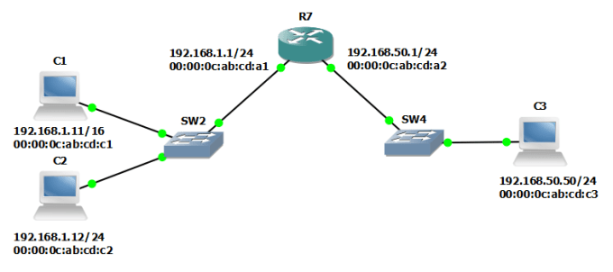

>ARP proxy là công nghệ giúp các thiết bị như router, NAT... trả lời các thông điệp ARP request cho địa chỉ MAC mà nó biết.

- Khi router nhận được thông điệp ARP request cho địa chỉ IP nào đó mà nó có giữ trong bảng ARP của nó, nó sẽ đáp trả lại thông điệp ARP reply với địa chỉ MAC là chính nó.

- Proxy ARP là công nghệ giúp lấy địa chỉ MAC của các máy chung subnet nhưng kết nối với 2 cổng khác nhau  trên 1 router.

Ví dụ:

C1 muốn tìm địa chỉ MAC của C3, để ý rằng mặt nạ mạng của C1 là 16 nên nó nghĩ là C3(192.168.50.50/24) nẳm trong cùng 1 subnet với nó. C1 sẽ gửi thông điệp ARP request ra toàn mạng nên R7 cũng nhận được thông điệp này.

Thông điệp này tới R7, nhưng không tới được C3, nên không bao giờ có câu trả lời từ C3. C1 không thể liên lạc được với C3. Nhưng với ARP proxy, R7 sẽ trả lời C1.

R7 tìm thấy thông tin rằng địa chỉ IP của C3 nằm trong 1 mạng cục bộ bên trong bảng định tuyến. 

Nó sẽ trả lời thông điệp ARP của C1 rằng C3 có địa chỉ MAC là địa chỉ MAC của chính nó, C1 nghĩ rằng R7 chính là C3 và bắt đầu nói chuyện với R7, R7 nhận tin và chuyển lại cho C3.

R7 bây giờ sẽ đóng giả làm C3 và nói chuyện với C1, đóng gỉa là C1 để nói chuyện với C3. C1 và C3 nói chuyện với nhau mà không biết là đang nói chuyện với trung gian là R7.
