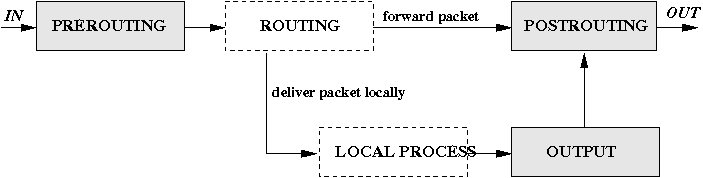

## Gói tin trong mạng

Khi nhận đươc gói tin thì receiver phải gán dữ liệu trong gói tin tới 1 tiến trình nào đó, đây là nhiệm vụ của tầng giao vận, cụ thể là TCP/UDP. Mỗi tiến trình sử dụng 1 cổng riêng để nhận gói tin. Cặp IP-port được gọi là socket và là duy nhất. Các tiến trình trong các máy giao tiếp với nhau qua các socket này.

## Linux và Netfilter

Netfilter là framework cung cấp khả năng biến 1 máy Linux với các cạc mạng trở t
hành 1 router NAT.



```PREROUTING``` chịu trách nhiệm với các gói tin được chuyển đến network interface. Tại đây việc định tuyến chưa xảy ra, gói tin chưa được quyết định là được là xử lí hay là được forward tói máy tính khác. Sau khi đi qua ```PREROUTING```, việc định tuyến được quyết định. Trong trường hợp người nhận là local, gói tin sẽ được chuyển tới tiến trình tương ứng mà không cần quan tâm đến NAT. Trong trường hợp người nhận là máy tính ở mạng khác, gói tin sẽ được chuyển tới interface tương ứng với mạng đó. Tuy nhiên trước khi gói tin được chuyển đi, nó sẽ đi qua ```POSTROUTING``` và đi ra khỏi interface. Đối với các gói tin được sinh local, nó sẽ không đi qua khối ```PREROUTING``` mà đi qua khối ```OUTPUT```, sau đó đi tới ```POSTROUTING```.

## Ví dụ: Kết nối 1 mạng private với Interner sử dụng NAT

Lấy ví dụ về bài toán người thuê nhà: có 1 chủ nhà và vài hộ thuê trong đó. Một người đưa thư sẽ không biết được vị trí của các hộ trong nhà nên những lá thư gắn địa chỉ cục bộ như phòng1-tầng1 sẽ thất lạc vì không biết giao đến chỗ nào. Việc được giải quyết khi chủ nhà cấp cho mỗi hộ 1 cái hòm để gửi thư vào, thư sau đó sẽ được chuyển tới trạm đưa thư. Chủ nhà lấy thư trong hòm ra, sửa lại địa chỉ người gửi trên thư là địa chỉ của mình cộng với số hòm thư của hộ thuê. Người nhận lá thư này sau đó gửi thư phản hồi với địa chỉ nhận trên thư là địa chỉ chủ nhà cộng với số hòm thư của hộ thuê. Chủ nhà nhận được thư, tìm hộ tương ứng với số hòm thư, sửa lại địa chỉ nhận thành địa chỉ hộ thuê và trao thư. Hộ thuê nhà không biết việc sửa địa chỉ và việc gửi thư là trong suốt.

Trong 1 mạng con, người chủ nhà tương ứng với router(nếu đặt router là gateway), còn người thuê nhà là các máy tính trong mạng con đó. Số hòm thư là số port nào đó đang rỗi trên router. Router phát đi gói tin với địa chỉ là địa chỉ của chính nó và số port tương ứng với máy con trong mạng. 

#### Nhược điểm của NAT

Các máy trong mạng con có thể truy cập được internet nhưng chiều ngược lại thì không. Một máy tính trên mạng internet không thể thiết lập kết nối tới 1 máy trong mạng cục bộ, nó chỉ có thể dùng địa chỉ 1 port trên router. Nhưng port này thường không được sử dụng và gói tin bị loại bỏ, cả kể port này đang được sử dụng bởi 1 máy nào đó trong mạng nhưng máy này lại đang bận kết nối với máy khác thì gói tin cũng bị hủy bỏ. Thiết lập kết nối từ bên ngoài vào trong mạng cục bộ là điều gần như không thể. Nhưng ta có thể cấu hình tĩnh để cho 1 port trên router chịu trách nhiệm cho 1 máy trong mạng, ví dụ cấu hình cổng 80 trên router kết nối tới HTTP-server trong mạng.
 
