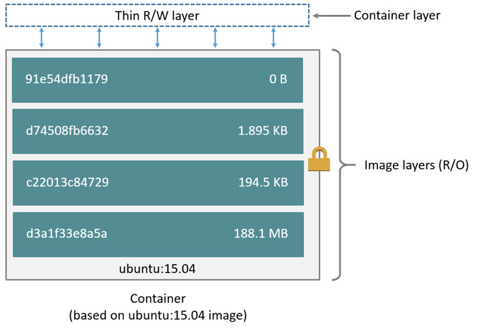

### Image

Là 1 file chứa các thông tin để tạo ra container. Các image được xây dựng bằng cách kế thừa nhau, 1 image này được xây dựng trên 1 image kia.

Ta có thể tự tạo image hoặc sử dụng image có sẵn trêm registry. Để tạo image cần có Dockerfile và các file khác cần thiết.

Trong Dockerfile có các lệnh, mỗi lệnh tạo ra 1 layer mới trên image gốc. Các layer xếp chồng lên nhau.



Vậy image bản chất là gì?.

Khi cài đặt Docker với ubuntu 18.04 ta có phiên bản docker sử dụng ```overlay2``` để lưu trữ các layer của image.

Các layer của image được lưu trữ trong thư mục ```/var/lib/docker/overlay2``` của máy chủ.

Ví dụ khi thực hiện lệnh ```docker pull ubuntu```, các layer của image này sẽ xuất hiện như sau:

```
root@tuyen:/var/lib/docker/overlay2# ls -l
total 24
drwx------ 4 root root 4096 Thg 7 26 21:37 216253d25598256bad145982efcd02a362c7bf8ed6dd782f2265f94bd180ebf5
drwx------ 4 root root 4096 Thg 7 26 21:37 3217b5a80449e8e7e9542a2d17f12261ad2ecbc886610bb6a7ef752010475a9c
drwx------ 4 root root 4096 Thg 7 26 21:37 7c09f0f3f9fcbde728c212cb4a1596245f6ad8c8eb6825bb3c14f41e2c83083b
drwx------ 3 root root 4096 Thg 7 26 21:37 a90f42e7f6bb33c6561bf1300f7924ad857ed8e2039199ed8f923493b8b738aa
drwx------ 4 root root 4096 Thg 7 26 21:37 b8c7b2e3feaef7343cbe5bc159b5e1e73ba18e624aa3d515237d677f0fa970e9
drwx------ 2 root root 4096 Thg 7 26 21:37 l
```

Thư mục l chứa các symbolic link tới các nội dung layer được đặt tên ngắn đi để tránh bị giới hạn độ dài trong câu lệnh ```mount```.

```
lrwxrwxrwx 1 root root 72 Thg 7 26 21:37 G6FTYCSQV26I4MUGU3NOHMVDDP -> ../3217b5a80449e8e7e9542a2d17f12261ad2ecbc886610bb6a7ef752010475a9c/diff
lrwxrwxrwx 1 root root 72 Thg 7 26 21:37 GQFL2I3SQDPGEGOL4EUS4MU5A6 -> ../a90f42e7f6bb33c6561bf1300f7924ad857ed8e2039199ed8f923493b8b738aa/diff
lrwxrwxrwx 1 root root 72 Thg 7 26 21:37 HYJO2Q7V5BWBLG6LRNOW3SCRVZ -> ../b8c7b2e3feaef7343cbe5bc159b5e1e73ba18e624aa3d515237d677f0fa970e9/diff
lrwxrwxrwx 1 root root 72 Thg 7 26 21:37 I6L7C3UEWI2AWEF36R7VGL32FH -> ../216253d25598256bad145982efcd02a362c7bf8ed6dd782f2265f94bd180ebf5/diff
lrwxrwxrwx 1 root root 72 Thg 7 26 21:37 V3MSVP36PJGCKRJXROAQ4UTFFN -> ../7c09f0f3f9fcbde728c212cb4a1596245f6ad8c8eb6825bb3c14f41e2c83083b/diff
```

Image trên có 5 layer tương ứng với 5 câu lệnh trong [Dockerfile](https://github.com/tianon/docker-brew-ubuntu-core/blob/427069746055e4cdeca1d2d34c93d756beb07f84/bionic/Dockerfile) tạo ra image này.

Trong layer thấp nhất a90..., file ```diff``` chứa nội dung của layer(chính là khác biệt so với layer bên dưới nó trong chồng layer), và file ```link``` chưa tên symlink tới file ```diff``` này:

```
root@tuyen:/var/lib/docker/overlay2/a90f42e7f6bb33c6561bf1300f7924ad857ed8e2039199ed8f923493b8b738aa# ls
diff  link

root@tuyen:/var/lib/docker/overlay2/a90f42e7f6bb33c6561bf1300f7924ad857ed8e2039199ed8f923493b8b738aa/diff# ls
bin  boot  dev  etc  home  lib  lib64  media  mnt  opt  proc  root  run  sbin  srv  sys  tmp  usr  var

root@tuyen:/var/lib/docker/overlay2/a90f42e7f6bb33c6561bf1300f7924ad857ed8e2039199ed8f923493b8b738aa# cat link 
GQFL2I3SQDPGEGOL4EUS4MU5A6
```


Các tầng phía trên, mỗi tầng chứa 1 file tên là ```lower``` chỉ ra tầng bên dưới nó, 1 thư mục ```diff``` chứa nội dung tầng này, 1 thư mục ```work``` được sử dụng bởi OverlayFS.


```
root@tuyen:/var/lib/docker/overlay2/b8c7b2e3feaef7343cbe5bc159b5e1e73ba18e624aa3d515237d677f0fa970e9# ls
diff  link  lower  work

root@tuyen:/var/lib/docker/overlay2/b8c7b2e3feaef7343cbe5bc159b5e1e73ba18e624aa3d515237d677f0fa970e9# ls diff/
run

root@tuyen:/var/lib/docker/overlay2/b8c7b2e3feaef7343cbe5bc159b5e1e73ba18e624aa3d515237d677f0fa970e9# cat lower 
l/V3MSVP36PJGCKRJXROAQ4UTFFN:l/I6L7C3UEWI2AWEF36R7VGL32FH:l/G6FTYCSQV26I4MUGU3NOHMVDDP:l/GQFL2I3SQDPGEGOL4EUS4MU5A6

root@tuyen:/var/lib/docker/overlay2/b8c7b2e3feaef7343cbe5bc159b5e1e73ba18e624aa3d515237d677f0fa970e9# cat link 
HYJO2Q7V5BWBLG6LRNOW3SCRVZ
``` 

Câu lệnh đầu tiên trong Dockerfile của image này là :```ADD ubuntu-bionic-core-cloudimg-amd64-root.tar.gz /```, thực hiện việc giải nén file tar vào thư mục ```/``` của image. File nén này chứa các thư mục của layer đầu tiên:

```
bin  boot  dev  etc  home  lib  lib64  media  mnt  opt  proc  root  run  sbin  srv  sys  tmp  usr  var
```

Mỗi câu lệnh trong Docker file đều tác động lên các thư mục trên layer này để tạo ra layer tiếp theo. Các layer sẽ được ```overlay2``` gộp lại tạo thành view trong suốt đối với container, kết quả:

```
root@50f17e12bebb:/# ls
bin  boot  dev  etc  home  lib  lib64  media  mnt  opt  proc  root  run  sbin  srv  sys  tmp  usr  var
```

<b>Vậy image thực ra là 1 file nén chứa filesystem của container.</b> Bên trong file này chứa đầy đủ các file mã nguồn, run-time, thư viện để mỗi khi ta gọi 1 dịch vụ ví dụ bash chẳng hạn, hệ điều hành sẽ đi đến tìm file ```/bin/bash``` trong filesystem của container và thực thi. Đây là lí do mà container khởi động rất nhanh và tốn ít tài nguyên so với VM do các tiến trình được thực thi trực tiếp từ máy chủ.

### Tài liệu tham khảo

- [1]. [https://docs.docker.com/storage/storagedriver/overlayfs-driver](https://docs.docker.com/storage/storagedriver/overlayfs-driver/#limitations-on-overlayfs-compatibility)
