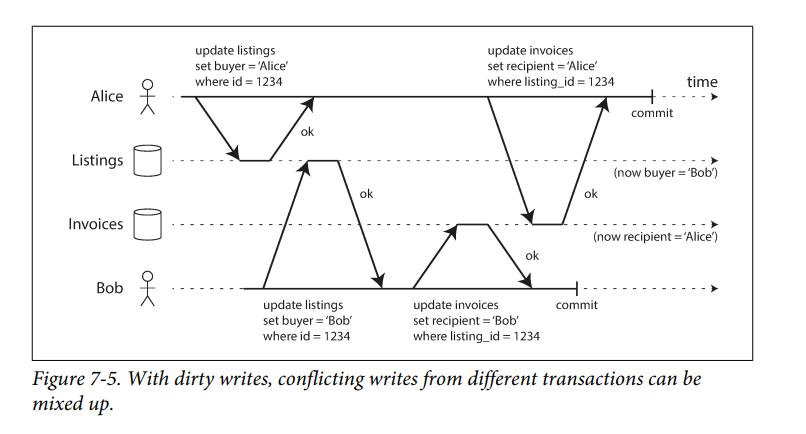
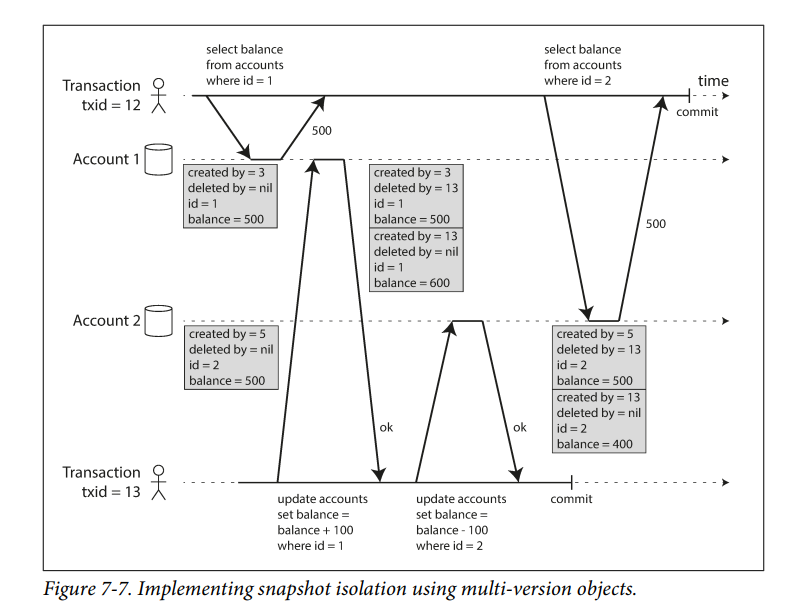

Khi 1 hệ thống hoạt động thì luôn luôn có rủi ro lỗi. Transaction được tạo ra với mục đích đơn giản hóa việc truy cập tới DB. Với transaction, ứng dụng được giải phóng khỏi việc xử lí nhiều lỗi cơ bản và vấn đề đọc ghi đồng thời vì các công việc này được đẩy qua DB xử lí.

## Ý nghĩa của thuật ngữ ACID

### Atomic

Atomic là thuật ngữ để chỉ những thứ không thể chia nhỏ thêm nữa. 
Trong thuật ngữ ACID, atomic mô tả kểt quả khi client thực hiện một vài lệnh ghi dữ liệu liên tiếp nhau, một trong số đó không thành công do lỗi - lỗi mạng, full ổ cứng, lỗi ràng buộc trên dữ liệu .... Nếu các lệnh ghi này được nhóm thành 1 atomic transaction thì tất cả các lệnh ghi thành công trước đó phải được loại bỏ (aborted).
Nếu không có atomic thì khi xảy ra lỗi ta ko thể biết được lệnh ghi nào thành công và phải thử lại ở lần ghi tiếp theo. Việc này dẫn tới việc ghi thực hiện 2 lần. Khi có atomic thì ứng dụng biết được là có lỗi, dữ liệu không bị thay đổi gì và đơn giản là thực hiện lại hành động.

### Isolation

Hầu hết các hệ quản trị cơ sở dữ liệu đều được truy cập từ nhiều client cùng lúc. Sẽ không có vấn đề gì nếu chúng đọc ghi các phàn không liên quan tới nhau của dữ liệu, nhưng nếu có bất kì sự chông chéo nào thì sẽ luôn có vấn đề về race condition.
Isolation trong ACID có nghĩa là các transaction đều độc lập với nhau, tuy chúng thực hiện đồng thời nhưng tác động mang lại như được thực hiện tuần tự (serializability).
Trong thực tế có nhiều mức isolation khác nhau, lỏng hơn là serial.

### Durability

Dữ liệu được lưu 1 cách tin cậy.

Ở hệ thống single node đều này có nghĩa là dữ liệu được ghi xuống disk cộng với write log để khôi phục lại trạng thái khi hệ thống xảy ra lỗi.

## Weak Isolation Levels

Race condition thực sự xảy ra khi có bất kì thao tác ghi nào được thực thi đồng thời.

DB có thể đơn giản là mặc kệ có bao nhiêu request cứ thực hiện tuần tự (serializable) và chẳng có lỗi nào xảy ra dc.

Trong thực tế, serializable làm giảm hiệu năng đi rất nhiều và hệ thống không muốn thế. Nhiều mức isolation được tạo ra để đánh đổi giữa hiệu năng và tính đúng đắn này.

### Read committed

Đây là mức cơ bản nhất, bảo đảm 2 mục tiêu:

- Khi đọc sẽ chỉ đọc dữ liệu đã đc commit (no dirty reads).

- Khi ghi sẽ chỉ ghi đè dữ liệu đã được commit(no dirty writes).

#### No dirty reads

Giả sử có 1 transaction thực hiện ghi dữ liệu nhưng chưa commit hoặc là abort, câu hỏi đặt ra là transaction khác có thể đọc được dữ liệu đã thay đổi này không, nếu có thì đây gọi là dirty reads.

### No dirty write

Object đang được ghi bởi 1 transaction (chưa finish) thì transaction khác không thể ghi đè vào đc.

DB sử dụng cơ chế lock để tránh dirty write, update sẽ được lưu luôn vào lock để khi transaction nhả lock ra thì data sẽ được ghi đè tới db. Lúc đọc thì không cần sử dụng lock để tránh giảm hiệu năng.

### Snapshot Isolation and Repeatable Read

Đôi lúc ta muốn backup toàn bộ db hoặc là chạy 1 câu truy vấn phân tích trên dữ liệu. Yêu cầu đặt ra là làm cách nào để dữ liệu từ lúc bắt đầu thực hiện lệnh tới khi kết thúc là ko đổi cho dù có rất nhiều transaction khác đang thực hiện ghi vào db.

Điều này đạt được bằng cách lưu nhiều version khác nhau của dữ liệu. Mỗi khi dữ liệu được thêm hoặc sửa xóa, nó được nhân bản ra thành 1 bản ghi mới đính kèm với id của transaction thực hiện.

1 transaction thực hiện đọc dữ liệu sẽ chỉ đọc được:

- Dữ liệu đã được commit

- Dữ liệu với transaction id nhỏ hơn transaction id hiện tại.

Hành động xóa hoặc sửa đều sinh ra 1 version mới.

Làm thế nào implement tính năng này trên index. Có 2 cách tiếp cận: một là lưu tất cả các version của object vào db, khi truy vấn db phải lọc bỏ những object không tương thích với transaction hiện tại; hai là thay vì thực hiện thay đổi trên các page của tree thì thực hiện copy nguyên cả page và để trỏ tới page mới này thì toàn bộ từ page cha đến gốc đều được copy thành node mới. Mỗi transaction write đều tạo ra root mới nên dữ liệu đọc được ở trong 1 transaction là nhất quán.

### Preventing Lost Updates

Read committed và snapshot isolation chỉ tập trung giải quyết vấn đề khi có 1 transaction đọc trong khi có nhiều transaction khác đang ghi.

Vấn đề cũng có thể xảy ra khi cả 2 transaction cùng ghi vào 1 object, lúc đó có thể xảy ra trường hợp 1 trong 2 update bị mất hiệu lực. Ví dụ: 

- Tăng 1 biến đếm hoặc cập nhật số dư tài khoản trong db (yêu cầu thực hiện việc đọc giá trị hiện tại và tăng lên rồi ghi lại vào db)

- Thay đổi 1 trường trong dữ liệu JSON (đọc, parse rồi ghi lại vào db)

- 2 người cùng sửa 1 trang wiki sau đó lưu thay đổi cả trang đã thay đổi cùng làm chỉ có 1 trong 2 được lưu.

Cách giải quyết có thể dùng atomic operation của db, sử dụng lock hoặc là db detect và yêu cầu user sửa lỗi.

### Serializability

Serializable là mức isolation cao nhất, ở đó mọi thứ được đảm bảo như đang thực hiện tuần tự. Chính vì vậy loại bỏ mọi vấn đề về concurrency.

Nhưng để implement mức này là rất tốn kém. Các lựa chọn bao gồm thực hiện tuần tự, giao thức khóa 2 pha, hoặc là Serializable Snapshot Isolation (SSI).

### Two-Phase Locking (2PL)

Khi đã lấy khóa thì lấy liên tục không nhả, khi đã nhả thì chỉ có nhả không được lấy thêm khóa.

Vẫn có thể xảy ra trường hợp dealock, db tự động phát hiện và abort 1 vài transaction, thường chỉ có 3 transaction trong 1 deadlock.

1 vấn đề xảy ra với việc sử dụng khóa là nếu truy vấn không trả về kết quả thì sẽ không thể attack khóa lên object được. Có 1 cách để giải quyết vấn đề này là sử dụng khóa trên điều kiện tìm kiếm. Khi 1 transaction chỉ ra rằng nó muốn đọc ghi trên 1 khoảng dữ liệu thì không có transaction nào khác có thể thao tác được. 

Để implement predicate lock người ta sử dụng index-range lock. Lock trên 1 khoảng dữ liệu rộng hơn cần thiết. Lock trên 1 node  hoặc là toàn bộ tree nếu không thể tìm node phù hợp.

### Serializable Snapshot Isolation (SSI)

Việc quản lí concurrency có thể chia làm 2 loại là cách lạc quan và bi quan. Bi quan ngăn không cho bất cứ lỗi nào có thể phát sinh được xảy ra còn lạc quan là cứ để cho lỗi xảy ra rồi tìm và sửa chữa.

Làm thế nào để phát hiện ra xung đột? Xung đột chỉ xảy ra khi transaction đọc dữ liệu từ 1 snapshot cũ làm nó ra quyết định sai khi ghi dữ liệu. Có 2 trường hợp: 

- Dữ liệu đã được thay đổi trc khi được đọc nhưng transaction thực hiện thay đổi này chưa commit

- Sau khi đọc chưa kịp xử lí thì đã có transaction nhanh tay thay đổi nó và commit.

Cả 2 trường hợp này db cần detect và abort transaction hiện tại.