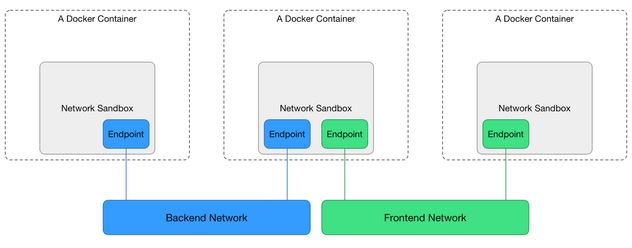

## Mục lục

- 1. [Host](#1)
- 2. [Bridge](#2)

### Host

Các container sẽ dùng chùng chồng mạng của máy chủ. 

2 container sẽ không thể mở cùng 1 cùng cổng TCP.

Tương đương với đa tiến trình thông thường trên máy tính chủ. Đạt hiệu năng cao.

### Bridge

Sử dụng các công cụ của Linux: Bridge, network namespace, virtual ethernet device(veth), iptables.

<b>Linux bridge</b> hoạt động như thiết bị switch bên trong nhân Linux, chuyển tiếp gói tin dựa trên địa chỉ MAC, tự động nhận diện từ các luồng tin.

<b>Network namespaces </b>là 1 chồng mạng riêng với các interfaces, bảng định tuyến, tường lửa. CUng cấp sự tách biệt giữa các tiến trình, đảm bảo 2 container sẽ không bao giờ giao tiếp được với nhau trừ khi được cấu hình rõ ràng để làm thế.

<b>Veth</b> là interface đóng vai trò là kết nối giữa 2 network namespace. Mỗi namespace có 1 veth.Khi container được gắn với Doker Network, 1 đầu của kết nối sẽ gắn vào bên trong container dưới tên ethx, đầu còn lại gắn vào Docker Network.

<b>Iptables</b> là hệ thống lọc gói tin, đóng vai trò là tường lửa, đánh dấu gói tin, làm giả và drop gói tin. Docker Driver sử dụng iptables để phân mảnh mạng, ánh xạ cổng, đánh dấu và load balance các gói tin.

Mô hình :

<b>Sandbox</b> chứa cấu hình mạng của container.

<b>Endpoint</b> kết nối Sandbox tới mạng bên ngoài.

<b>Network</b>: tập hợp của các Enpoint đang kết nối với nhau.
