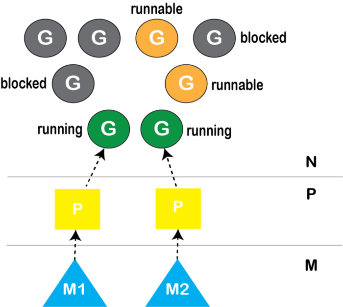

## Golang Package

Một package có thể bao gồm nhiều file code. Tất cả các file trong cùng package phải nằm trong cùng 1 thư mục, thư mục chứa các file code của 1 package gọi là thư mục của package. Các file nằm trong một thư mục (không bao gồm các file nằm trong thư mục con) phải thuộc cùng 1 package.

Package có đường dẫn import chứa ```internal``` là 1 package đặc biệt. Nó chỉ có thể được import từ các package nằm trong thư mục cha của thư mục ```internal```, ví dụ package ```.../a/b/c/internal/d/e/f``` và ```.../a/b/c/internal``` chỉ có thể được import bởi packet có đường dẫn bắt đầu bởi ```.../a/b/c```

Module là các package được tập hợp lại có cùng thư mục gốc. Biến ```GO111MODULE``` điều khiển tính năng module, có thể là on, off hoặc auto.

Nếu package nằm trong thư mục ```GOPATH/src ```, module feature off thì đường dẫn import của nó chính là đường dẫn tương đối tới ```GOPATH/src``` hoặc tới thư mục ```vendor``` gần nhất chứa thư mục của package.

Ví dụ: 

```bash
_ GOPATH
  |_ src
     |_ x
        |_ vendor
        |  |_ w
        |     |_ foo
        |        |_ foo.go    // package foo
        |_ y
        |  |_ vendor
        |  |  |_ w
        |  |     |_ foo
        |  |        |_ foo.go // package foo
        |  |_ y.go            // package y
        |_ z
        |  |_ z.go            // package z
        |_ x.go               // package x
```

- import path của 2 package foo đều là w/foo

- import path của x, y, z lần lượt là x, x/z, x/y

Khi module feature là on, đường dẫn import của module được chỉ ra trong file ```go.mod``` nằm trong thư mục gốc của module. Đường dẫn này được sử dụng làm tiền tố cho tất cả các đường dẫn import của các  package trong module. Ngoại lệ đối với thư mục ```vendor``` nằm trong thư mục gốc của module. 

Ví dụ: 

```bash
_ MyProject
     |_ go.mod                // module example.com/mypkg
     |_ vendor
     |  |_ w
     |     |_ foo
     |        |_ foo.go       // package foo
     |_ x
        |_ y
        |  |_ vendor
        |  |  |_ w
        |  |     |_ foo
        |  |        |_ foo.go // package foo
        |  |_ y.go            // package y
        |_ z
        |  |_ z.go            // package z
        |_ x.go               // package x

```

- Đường dẫn để import package foo đầu tiên là w/foo vì ```vendor``` được coi là thư mục đặc biệt

- Đường dẫn để import package foo thứ hai là ```example.com/mypkg/x/y/vendor/w/foo```

- ĐƯờng dẫn để import x, y, z tướng ứng là ```example.com/mypkg/x```, ```example.com/mypkg/x/y```, ```example.com/mypkg/x/z```

Khi 1 file trong package import 1 package khác, ta nói package đó phụ thuộc vào package được import.

Go không cho phép import vòng, nếu ```a``` phụ thuộc vào ```b```, ```b``` phụ thuộc vào ```c```, thì ```b``` không thể import ngược lại ```a```, ```c``` không thể import ngược lại ```b``` và cũng không thể import ```a``` do tạo thành vòng tròn. 

Tên của folder chứa package không nhất thiết cần phải giống với tên package.  

## Method

Go hỗ trợ lập trình hướng đối tượng và method là một trong các đặc trưng đó.

Trong Go, ta có thể khai báo 1 phương thức cho kiểu(type) ```T``` và ```*T```, với ```T``` thỏa mãn 4 điều kiện:

- ```T``` phải là ```defined type```

- ```T``` phải được định nghĩa trong cùng package với phương thức

- ```T``` không được là kiểu con trỏ

- ```T``` không được là kiểu interface 

Kiểu ```T``` và ```*T``` được gọi là receiver type tương ứng với phương thức được khai báo cho chúng. 

Khi khai báo phương thức với value receiver, trình biên dịch tự động tạo một phiên bản tương ứng cho kiểu pointer của cùng kiểu đó. 

### Method propertypes và Method Set

Mỗi khai báo phương thức có thể được coi bao gồm từ khóa ```func```, receiver parameter, method propertype và phần thân phương thức(body)

Ví dụ:

```go
Pages() int
SetPages(pages int)
```

Mỗi type có 1 method set, method set của một kiểu ko phải interface là tổ hợp của tất cả method propertype được khai báo cho kiểu đó.

Method set của kiểu ```T``` luôn luôn là tập con của method set của kiểu ```*T```

## Interface

### Method set

Mỗi kiểu có 1 method set đi kèm:

-

## Value Parts

Ở ngôn ngữ C, mỗi giá trị chiếm 1 khối bộ nhớ liên tục, khác với C, các giá trị trong Go có thể chiếm nhiều đoạn rời rạc trong bộ nhớ, các phần này gọi là các value parts. Trong đó, có 1 đoạn gọi là direct part trỏ đến các underlying part khác. Direct part chính là 1 con trỏ dùng để trỏ đến các phần còn lại của giá trị. 

|Kiểu có giá trị nằm trong 1 khối bộ nhớ duy nhất|Kiểu có giá trị nằm trong nhiều khối bộ nhớ|
|:------------------------------------------------:|:-------------------------------------------:|
|Solo Direct Value Parts                       |Direct Part-> Underlying Part            |
|boolean types, numeric types, pointer types, unsafe pointer types,struct types,array types | slice types, map types, channel types, function types, interface types, string types|

Struct có chứa con trỏ được gọi là pointer wrapper type, 1 kiểu có giá trị chứa con trỏ là pointer holder type. Kiểu con trỏ và kiểu pointer wrapper đều là kiểu pointer holder, 1 mảng kiểu pointer holder cũng là kiểu pointer holder.

Các kiểu loại thứ 2 trong bảng trên đều là pointer holder. Có nghĩa giá trị không của chúng đều là ```nil```

### Underlying part không được sao chép khi thực hiện phép gán gía trị

Khi thực hiện phép gán, chỉ có direct part là được sao chép từ giá trị nguồn sang giá trị đích, cả 2 đều tham chiếu đến cùng underlying part.


## Array, Slices, Map

3 kiểu trên gọi là kiểu container. Mỗi giá trị của 1 trong các kiểu trên được sử dụng để chứa 1 tập hợp các phần tử. Kiểu của các phần tử được lưu trữ là giống nhau.  Mỗi phần tử trong 1 trong container được găn với 1 key. Giá trị của phần tử có thể được truy cập và chỉnh sửa thông qua key này. Đối với kiểu map, key phải là kiểu comparable. Còn đối với array và slice key là kiểu ```int```, chỉ ra vị trí của phần tử trong mảng.

Mỗi kiểu container đều có thuộc tính độ dài, là số phần tử được lưu trong container. Array là kiểu chỉ có direct part còn slice và map các phần tử được lưu trong underlying part.

Các phần tử trong array hoặc slice được đặt kề nhau trong 1 đoạn bộ nhớ liên tục, còn với các phần tử trong map cũng nằm trong 1 vùng nhớ liên tục nhưng có thể không nằm kề nhau.

### Kí hiệu

- Array: ```[N]T```

- Slice: ```[]T```

- Map: ```map[K]T```

Lưu ý:
```go
[...]bool{false, true, true, false}
[...]bool{3: false, 1: true, true}
````

Kí hiệu ```...``` có nghĩa để cho trình biên dịch tự xác định độ dài của array. Đối với kiểu array và slice, index bắt buộc phải là hằng số ví dụ:

```go
var a uint = 1
var _ = map[uint]int {a : 123} // okay

// The following two lines fail to compile,
// for "a" is not a constant key/index.
var _ = []int{a: 100}  // error
var _ = [5]int{a: 100} // error
```
### Giá trị không cho các kiểu container

Đối với kiểu array ```A```, giá trị không được kí hiệu là ```A{}```, tất cả các phần tử trong đó đều là giá trị không của kiểu của các phần tử. 

Đối với slice và map giá trị 0 đều là ```nil```

Khi 1 biến array được khai báo mà không chỉ ra giá trị ban đầu, 1 vùng bộ nhớ đã được cấp phát cho tất cả các phần tử của array với giá trị là không. Bộ nhớ cho các phần tử của nil slice và map chưa được cấp phát.

Lưu ý ```[]T{}``` biểu diễn slice trống (0 có phần tử nào) khác với ```[]T(nil)```, giá trị không của slice (nil). Tương tự với map.

### Length và capacity

Dung lượng của array bằng length của nó. Dung lượng của map là vô hạn. Dung lượng của slice luôn lớn hơn hoặc bằng độ dài của nó.

Dung lượng và độ dài của array không đổi kể từ lúc khởi tạo, đối với slice có thể thay đổi trong lúc thực thi. 

### Truy cập và chỉnh sửa các phần tử

Phần tử gắn kèm với khóa ```k``` được lưu trữ trong container ```v``` được kí hiệu ```v[k]```.

### Cấu trúc của Slice

Cấu trúc của slice được định nghĩa bởi Go runtime như sau:

```go
type _slice struct {
	elements unsafe.Pointer // referencing underlying elements
	len      int            // length
	cap      int            // capacity
}
```

Struct trên mô tả bố cục phần direct part của slice.


Đoạn bộ nhớ chứa underlying part của slice có thể rất lớn tuy nhiên slice chỉ quan tâm đến phần màu xám ở giữa. Các vị trí nằm ở giữa ```len``` và ```cap``` không thuộc về slice, có thể thuộc về slice hoặc array khác.

Kết quả của hàm ```append``` là 1 slice có thể có cùng phần tử bắt đầu với slice gốc hoặc không, phụ thuộc và dung lượng và độ dài của slice ban đầu và số phần tử được nối thêm.

- Nếu số phần tử còn thừa không đủ để chứa các phần tử được thêm vào, 1 đoạn bộ nhớ mói sẽ được cấp phát để chứa slice kết quả, 2 slice này không có cùng vị trí bắt đầu.

- Và ngược lại

### Phép gán container

Nếu 1 map được gán cho 1 map khác thì 2 map này có cùng chung underlying part hay toàn bộ các phần tử. THêm hoặc xóa 1 map sẽ phản chiếu tới map khác.

Tương tự đối với slice. Tuy nhiên, nếu 1 slice thay đổi độ dài/ dung lượng thì không ảnh hưởng đến slice kia.

Nếu 1 array được gán cho 1 array khác, tất cả các phần tử được sao chép, do đó 2 array không có chung các phần tử.

### Tạo slice và map với hàm ```make```

Với map:

```go
make(M, n)
make(M)
```

Dòng đầu tiên khởi tạo map với phần bộ nhớ được khởi tạo để chứa ít nhất n phần tử. DÒng thứ 2 tạo map với bộ nhớ tùy thuộc vào trình biên dịch.

Với slice:

```go
make(S, length, capacity)
make(S, length)
```

Kiểu đầu tiên tạo mới slice với độ dài và dung lượng được chỉ định, kiểu thứ hai tạo slice với độ dài bằng với dung lượng. Tất cả các phần tử đều có giá trị không.

### Khởi tạo bằng ```new```

Hàm ```new``` có thể được dùng để cấp phát 1 giá trị cho bất kì kiểu nào và lấy về 1 con trỏ tham chiếu tới giá trị được cấp phát. Giá trị này là giá trị không của kiểu tương ứng.

Các phần tử trong map chỉ có thể thay đổi bằng 1 phần tử mới mà không thử sửa đổi từng phần. 

### Rút slice từ array và slice

Ta có thể thu được slice từ slice khác hoặc array bằng sử dụng cú pháp subslice. Các phần tử của slice mới và array hoặc slice ban đầu đều nằm trong trên 1 đoạn bộ nhớ hay chúng đều chia sẻ chung 1 số phần tử.

```go
baseContainer[low : high]       // two-index form
baseContainer[low : high : max] // three-index form
```


## Creational

### Singleton

1 đối tượng duy nhất cho ứng dụng, bảo đảm rằng không thể có trùng lặp cho đối tượng này. 

Ở lần gọi để sử dụng đối tượng này đầu tiên, nó được tạo và sử dụng giữa tất cả các phần của ứng dụng.

Ví dụ:

- Khi muốn sử dụng chung một kết nối tới cơ sở dữ liệu để thực hiện truy vấn

- Mở 1 kết nối SSH dể thực hiện vài tác vụ và không muốn mở nhiều kết nối

- Giới hạn truy vập tới tài nguyên, Singleton là cánh cửa để dẫn tới nó

### Builder

Sử dụng lại một quy trình nhiều lần để khởi tạo nhiều đối tượng của 1 interface. 

Builder pattern hỗ trợ khởi tạo đối tượng mà không cần khởi tạo các trường trực tiếp 

Lấy ví dụ về việc sản xuất phương tiện đi lại. Builder pattern được mô tả gồm có 1 nhà máy sản xuất (manufacturing), các quy trình (builder) và sản phẩm đầu ra (product). Nhà máy nhận vào 1 quy trình và cho ra sản phẩm tương ứng. Trong quy trình chứa sản phẩm đang hoàn thiện, trải qua các bước để thu được sản phẩm cuối cùng

Mỗi khi cần thêm 1 sản phẩm mới cần cài đặt lại interface Builder có sẵn.

BUilder pattern nhạy cảm với các thay đổi đối với quy trình xây dựng đối tượng, 1 thay đối sẽ làm ảnh hưởng tới tất cả quy trình hiện có.

### Factory Method

Ẩn đi thông tin về đối tượng, chỉ cung cấp thông tin qua interface với 1 số phương thức cần thiết. 

Ủy nhiệm việc khởi tạo đối tượng cho phân khác trong chương trình 

Làm việc ở mức interface thay vì mức cài đặt chi tiết

## Go Runtime

### Work Stealing

Go runtime thực hiện việc đưa các goroutine vào OS thread theo chiến lược gọi là work stealing.

Go tuân theo mô hình fork-join trong việc đa nhiệm, fork xảy ra khi goroutine khởi chạy, join xảy ra khi 2 hay nhiều goroutine được đồng bộ thông qua channel hoặc 1 kiểu trong ```sync```. Trong mô hình work stealing, mỗi processor chạy 1 thread, mỗi thread có 1 hàng đợi 2 chiều (double-ended queue/deque). Với một thread, quá trình thực hiện work stealing tuân theo các quy luật:

1. Tại điểm fork, đẩy task vào cuối hàng đợi của thread.

2. Nếu thread đang rỗi, lấy task từ hàng đợi của thread khác bất kì.

3. Khi đợi join từ goroutine khác, lấy task từ hàng đợi của chính nó ra.

4. Nếu deque của thread trống, thực hiện 1 trong 2:

	a. Dừng tại điểm join

	b. Lấy task từ deque của thread ngẫu nhiên.

Trong thực tế, có 4 loại queue để thread thực hiện lấy goroutine:

1. Local Run queue

2. Global Run queue

3. Network Poller

THứ tự thực hiện quét:

1. Local

2. Global

3. Network Poller

4. Work Stealing

Trên thực tế Go runtime thực thi mô hình 3 lớp M:P:N:



Trong Go runtime có 1 số lượng processer cố định (GOMAXPROCS), mặc định bằng với số core của CPU, có thể có nhiều thread hơn số nhân CPU. Đầu tiên, M được tạo để host P, P sau đó được lập lịch thực hiện G. 

Đối với goroutine thực hiện blocking call: thread thực hiện nó chắc chắn bị chặn dừng gây lãng phí CPU, go runtime lấy context P từ nó để trao cho thread khác, giúp cho các goroutine trong đó có thể được thực ththi. Khi lời gọi blocking call trả về, OS thread thử lấy lại context đã bị trao cho thread khác, Nếu không được, nó đặt goroutine đang giữ vào global queue và đi vào trạng thái nghỉ và tự đi vào thread pool của runtime. 

Đối với non-blocking call: goroutine được dừng và thread thưc hiện goroutine khác, khi lời gọi trả về, goroutine được chuyển vào network poller queue để được lập lịch tiếp tục thực hiện.

Tính công bằng:

Mỗi goroutine thực hiện quá 10ms được đánh dấu là có thể chiếm dụng. Tuy nhiên, việc chiếm dụng chỉ hoàn thành ở phần đầu lời gọi hàm (function prolog - việc set up thanh ghi và ngăn xếp trước khi gọi hàm hoặc kết thúc hàm). Go tự động thêm thêm vào function prolog 1 đoạn code thực hiện việc chiếm dụng.  

## Channel

Nhiệm vụ của channel là làm cho goroutine có thể hoạt động lại sau khi bị chặn dừng bởi hành động nhận hoặc gửi dữ liệu. 

Mỗi channel chứa 2 danh sách liên kết là ```senq``` và ```waitq```. Khi 1 goroutine thực hiện truyền thông điệp tới channel

1. lock channel

2. Kiểm tra ```recvq``` để lấy 1 goroutine từ hàng chờ, sau đó chuyển trực tiếp dữ liệu cho goroutine đó

3. Nếu ```recvq``` rỗng, kiểm tra xem buffer còn chỗ không, nếu còn thực hiện sao chép dữ liệu từ goroutine thực hiện ghi ra buffer.

4. Nếu buffer đầy, dữ liệu cần ghi được lưu vào trong cấu trúc goroutine (sudog), sau đó goroutine đi vào ```sendq``` và tạm dừng hoạt động. 

## Sync

### WaitGroup

WaitGroup là cách để đợi 1 tập hành động hoàn thành mà không quan tâm đến kết quả hoặc có cách để thu thập kết quả, tạo 1 điểm join cho các goroutine. Nếu không thì sử dụng ```select``` hiệu quả hơn. WaitGroup hoạt động giống 1 bộ đếm, gọi ```Add``` để tăng biến đếm, ```Done``` để giảm và ```Wait``` để đợi cho đi khi giá trị của biến bằng 0. 

###  Mutex và RWMutex

RWMutex khác với Mutex ở chỗ các goroutine có thể cùng đọc đồng thời đoạn găng thay vì chỉ 1 như Mutex, miễn là ko có writer nào đang giữ khóa. 

### Cond

Đợi 1 sự kiện diễn ra. Goroutine có thể dừng cho đến khi nó được đánh thức và kiểm tra sự kiện. Ví dụ:

```go
for conditionTrue() == false {
}
```

viết lại thành

```go
c := sync.NewCond(&sync.Mutex{})
c.L.Lock()
for conditionTrue() == false {
	c.Wait()
}
c.L.Unlock()
```

## Concurrency Pattern

### Or done channel

Stop goroutine khi có 1 trong các channel đóng. Thực hiện qua 1 hàm đệ quy 

### Error handling

Lỗi cần được gửi tới 1 phần khác chứa trạng thái của toàn bộ hệ thống để đưa ra quyết định.  

Điểm cốt lõi là gắn liền kết quả trả về cùng với lỗi có thể xảy ra. Điều này đại diện cho toàn bộ kết quả có thể xảy ra, tách biệt việc sinh kết quả và xử lí lỗi.

### Pipeline

Sử dụng khi xử lí dữ liệu stream hoặc theo batch. Gồm nhiều stage sắp xếp nối tiếp. 1 stage nhận dữ liệu vào, thực hiện xử lí và bắn thông tin ra.

### Fan-in, Fan-out

Fan-out: sử dụng nhiều goroutine để xử lí 1 input

Fan-in: sử dụng nhiều goroutine để gộp nhiều input thành 1

### Queuing

Sử dụng queue để tách 1 stage ra khỏi các stage khác. Sử dụng queue có thể làm tăng hiệu năng toàn bộ hệ thống chỉ trong trường hợp:

- Nếu batching request trong stage tiết kiệm thời gian

- Nếu trễ tại 1 stage làm sản sinh feedback loop trong hệ thống

Ví dụ cho trường hợp đầu tiên là việc buffer input vào 1 chỗ nhanh hơn (mem) so với đích để ghi (disk). 

### Context package 

```golang
var Canceled = errors.New("context canceled")
var DeadlineExceeded error = deadlineExceededError{}

type CancelFunc
type Context

func Background() Context
func TODO() Context
func WithCancel(parent Context) (ctx Context, cancel CancelFunc)
func WithDeadline(parent Context, deadline time.Time) (Context, CancelFunc)
func WithTimeout(parent Context, timeout time.Duration) (Context,CancelFunc)
func WithValue(parent Context, key, val interface{}) Context
````

Trong các chương trình thực hiện tính toán đồng thời, việc ngắt các hành động là hay xảy ra do timeout, việc hủy bỏ hoặc lỗi từ các phần khác của hệ thống. Ta có thể sử dụng channel ```done``` trong toàn bộ chương trình để lan truyền thông báo kết thúc. Tuy nhiên, sẽ hữu ích hơn nếu ta có thể truyền thêm các thông tin về việc ngắt bên cạnh tín hiệu ngắt. Việc này chính là lí do để package ```context``` được tạo ra. 

```golang
type Context interface {
   // Deadline returns the time when work done on behalf of this
   // context should be canceled. Deadline returns ok==false when no
   // deadline is set. Successive calls to Deadline return the same
   // results.
   Deadline() (deadline time.Time, ok bool)
   // Done returns a channel that's closed when work done on behalf
   // of this context should be canceled. Done may return nil if this
   // context can never be canceled. Successive calls to Done return
   // the same value.
   Done() <-chan struct{}
   // Err returns a non-nil error value after Done is closed. Err
   // returns Canceled if the context was canceled or
   // DeadlineExceeded if the context's deadline passed. No other
   // values for Err are defined. After Done is closed, successive
   // calls to Err return the same value.
   Err() error
   // Value returns the value associated with this context for key,
   // or nil if no value is associated with key. Successive calls to
   // Value with the same key returns the same result.
   Value(key interface{}) interface{}
}
```

```Done()``` trả về 1 channel bị đóng khi goroutine kết thúc, ```Deadline``` trả về thời gian tối đã để thực hiện công việc nếu không goroutine sẽ bị buộc dừng, ```Error``` trả về không nil nếu goroutine bị buộc dừng. ```Value``` dùng để set các giá trị của từng request. TÓm lại, mục đích chính của ```context```:

- Cung cấp 1 API để hủy bỏ 1 nhánh goroutine

- Cung cấp các để truyền dữ liệu giữa các goroutine thuộc cùng 1 request, bằng cách truyền context làm tham số đầu tiên của các lời gọi hàm.

Trong ```Context``` interface, không hề có cách nào để thay đổi trạng thái của cấu trúc bên dưới. Việc này bảo vệ hàm ở đầu call stack khỏi việc bị các hàm con hủy bỏ context. Kết hợp với phương thức ```Done``` tả về ```done``` channel, cho phép ```Context``` có thể kiểm soát được tín hiệu cancel từ phía trên call stack. 

```golang
func WithCancel(parent Context) (ctx Context, cancel CancelFunc)
func WithDeadline(parent Context, deadline time.Time) (Context, CancelFunc)
func WithTimeout(parent Context, timeout time.Duration) (Context, CancelFunc)
```

Tất cả các phương thức đều nhận vào 1 ```Context``` và trả về 1 ```Context``` khác. 

```WithCancel``` trả về 1 ```Context``` sẽ đóng ```done``` channel khi hàm ```cancel``` được gọi. ```WithDeadline``` trả về 1 ```Context``` đóng ```done``` channel khi đạt tới 1 thời điểm ```deadline``` nào đó. ```WithTimeOut``` trả về 1 ```Context``` đóng ```done``` channel sau 1 khoảng ```timeout```.

Nếu 1 hàm muốn hủy các hàm khác phía dưới nó trong call-graph, nó sẽ gọi 1 trong các hàm trên và truyền ```Context``` trả về cho các hàm nó gọi. Nếu hàm không muốn thay đổi hành động hủy này, nó chỉ cần truyền ```Context``` mà nó nhận được cho các hàm con.

Bằng cách này, các lớp kế tiếp nhau trong call-graph có thể tạo ```Context``` đáp ứng nhu cầu mà không làm ảnh hưởng đến lớp phía trên.

Trên cùng của stack call, không thể truyền ```Context``` mà phải tạo bằng cách sử dụng 2 hàm:

```go
func Background() Context
func TODO() Context
```

```Background``` trả về 1 ```Context``` trống. ```TODO``` cũng tương tự nhưng không được sử dụng trong production.

## Đa nhiệm ở mức mở rộng

### Lan truyền lỗi 

Lỗi cần chứa thông tin về:

- Cái gì đã xảy ra: full disk, socket timeout, xác thực hết thời gian,...

- Xảy ra khi nào và ở đâu: lỗi cần chứa thông tin về toàn bộ stack trace từ khi gọi đến khi phát sinh lỗi cũng như nơi xảy ra ví dụ như xảy ra ở máy chủ nào, và cần chứa nhãn thời gian nó xảy ra.

- Thông điệp thân thiện với người dùng: thông điệp được hiển thị tới người dùng, được rút gọn từ 2 thông tin trên

- Làm cách nào để người dùng truy cập thêm thông tin: gắn thêm ID...

Mặc định thì lỗi không thể chứa các thông tin trên trừ khi được gán thêm vào. Do đó, nếu lỗi không chứa thông tin trên thì có thể coi là bug, ngược lại đó chỉ là trường hợp biên. Chương trình có thể chứa nhiều mô đun, ở biên giữa 2 mô đun lỗi được kiểm trả và chuyển đổi định dạng. Bất kì lỗi nào đi qua mô đun mà không tuân theo mô hình lỗi của mô đun đều bị coi là bug. 
