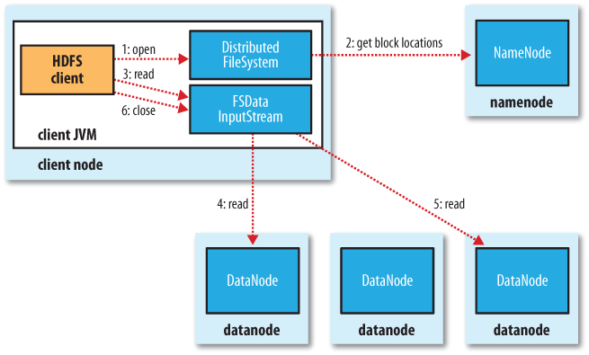
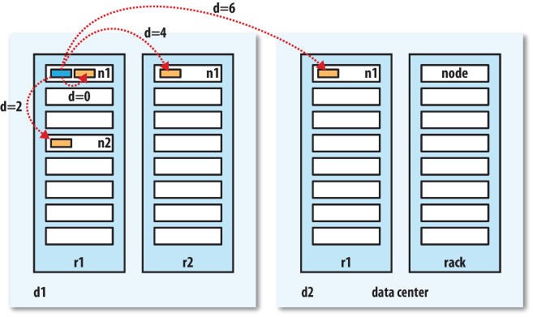
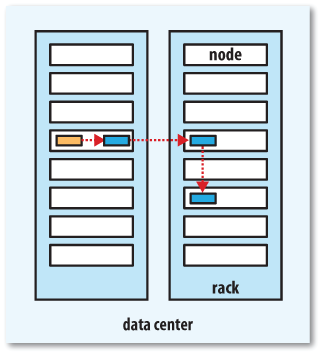
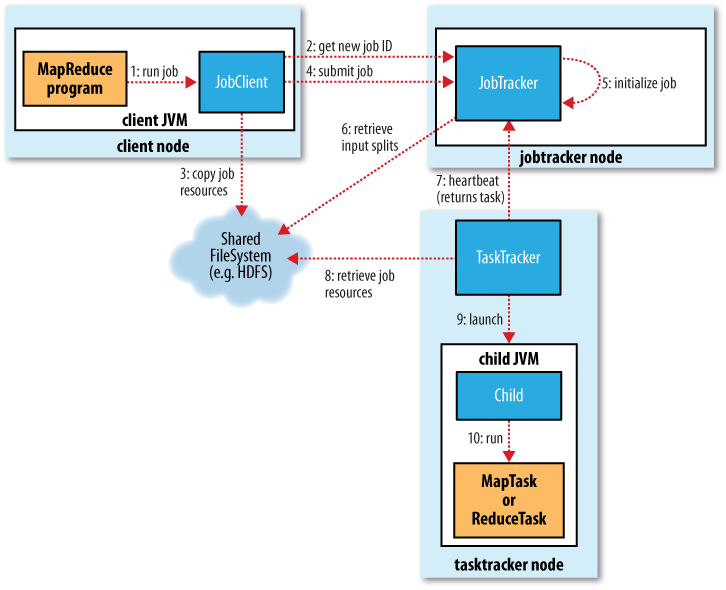
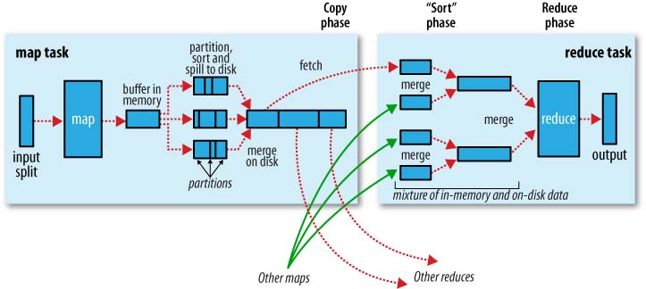

## MapReduce 

- MapReduce hoạt động bằng cách chia tính toán làm 2 pha: pha map và pha reduce.

- Mỗi pha nhận các cặp key-value làm đầu vào và đầu ra do người lập trình chỉ định. Người lập trình cũng viết 2 hàm: hàm map và hàm reduce.

- 1 chương trình Map-Reduce cần 1 hàm map, 1 hàm reduce và các thủ tục để chạy 2 hàm này.

### Map

- Lớp map cài đặt interface ```Mapper``` với 4 tham số chỉ ra kiểu của input key, input value, output key, output value.

- Phương thức ```map()``` được truyền 1 cặp key-value và 1 đối tượng ```OutputCollector``` để ghi output.

### Reduce

- Tương tự như lớp map

### Các thủ tục để thực hiện Map-Reduce

- job

- task

- jobtracker

- tasktracker

- input split

- record

- Map task ghi output ra local disk, nếu có lỗi Hadoop tự động chạy map trên node khác.

- ```combiner function``` nhận đầu vào là output của map function, đưa đầu ra cho input của reduce function. Giúp làm giảm lượng dữ liệu truyền giữa map và reduce.

---
## HDFS

Được thiết kế hoạt động trên hệ thống:

- Very large file

- Streaming data access

- Phần cứng thông thường

Hoạt động không tốt nếu:

- Low-latency data access

- Rất nhiều file nhỏ

- Không hỗ trợ nhiều người dùng cùng ghi 1 file, không hỗ trợ chỉnh sửa file theo offset.

### HDFS Concepts

#### Blocks

- File trong HDFS được chia thành các block có kích thước cố định - mặc định là 64MB nhưng nếu file nhỏ hơn kích thước 1 block nó sẽ không chiếm toàn bộ 1 block.

- Kích thước block lớn để tối thiểu hóa chi phí dịch chuyển đầu đọc. Thời gian đọc block từ đĩa sẽ lớn hơn đáng kể so với thời gian định vị đầu đọc. Do đó thời gian truyền 1 file lớn tạo thành từ nhiều block sẽ chỉ phụ thuộc vào tốc độ đọc file từ đĩa cứng.

- Lợi ích:

   - Kích thước file lưu trữ có thể lớn hơn kích thước bất kì ổ đĩa cứng nào trên mạng.

   - Nhân bản để chịu lỗi, tăng tính khả dụng.

#### Namenode và Datanode

- 1 cluster HDFS hoạt động theo chế độ master-worker(namenode và datanode).

- Namenode quản lí hệ thống file, lưu trữ metadata, cấu trúc cây thư mục của toàn bộ hệ thống dưới dạng namespace image và edit log  trên đĩa cứng của nó. Ngoài ra, namenode còn giữ thông tin trên bvề vị trí block của các file trên datanode, thông tin này liên tục được xây dựng lại từ các datanode.

- Datanode là nơi lưu trữ thực sự của dữ liệu, nó thực hiện lưu trữ và lấy dữ liệu theo yêu cầu từ namenode hoặc client, báo cáo lại định kì cho namenode danh sách các block mà nó đang giữ.

- Để tránh việc namenode chết gây hỏng toàn bộ hệ thống, Hadoop cung cấp các giải pháp:

   - namenode có thể ghi metadata của nó sang nhiều nơi khác, không cùng 1 máy.
  
   - Sử dụng <i>secondary namenode</i>, có nhiệm vụ hợp namespace image với edit log để phòng khi có lỗi lấy ra sử dụng luôn.

### Data Flow

#### Đọc 

- Client giao tiếp trực tiếp với datanode để lấy dữ liệu theo chỉ dẫn của namenode để tìm được datanode tốt nhất cho từng block. Báo cáo lại tình trạng của datanode nếu có lỗi trong truyền thông hoặc dữ liệu bị lỗi. Namenode chỉ làm nhiệm vụ đáp ứng yêu cầu vị trí các block(được lưu trữ trong bộ nhớ chính) đảm bảo tốc độ và tránh tắc nghẽn.



#### Network Topology

- Hadoop coi toàn bộ mạng là 1 cây có gốc, khoảng cách giữa 2 nút mạng tính bằng tổng khoảng cách từ chúng đến tổ tiên chung gần nhất.

- Các level có thể không được định nghĩa rõ ràng tuy nhiên khoảng cách trong các trường hợp sau được coi là tăng dần:

   - Các tiến trình trên cùng 1 node = 0

   - Node trên cùng 1 rack = 2

   - Node khác rack nhưng cùng 1 data center = 4

   - Node khác data center = 6



#### Ghi

- Yêu cầu namenode kiểm tra và tạo bản ghi mới cho file, danh sách các datanode để ghi dữ liệu. Các datanode được xếp thành 1 pipeline, dữ liệu được ghi trên datanode đầu tiên và được chuyển tiếp tới các datanode tiếp sau trên pipeline.

#### Vị trí của các replica

- Replica đầu tiên được đặt tại client(nếu client nằm ngoài cluster, node này được chọn ngẫu nhiên)

- Replica thứ hai được chọn trên 1 node khác rack so với replica đầu

- Replica thứ 3 được đặt trên 1 node cùng rack so với replica số 2.



- Gọi ```sync()``` để tránh mất dữ liệu.


CHiến lược này cân bằng được giữa sự tin cậy(các block được đặt trên 2 rack), băng thông ghi(hành động ghi chỉ cần chạy qua 1 switch trên mạng), tốc độ đọc(có 2 rack để lựa chọn đọc), phân bố block ra cluster.

---
## Hadoop I/O

### Checksum

- HDFS tính checksum cho tất cả dữ liệu được ghi và kiểm tra checksum khi đọc dữ liệu.

- Lỗi có thể được phát hiện khi client đọc dữ liệu, ngoài ra mỗi datanode có 1 luồng chạy nền ```DataBlockScanner``` liên tục kiểm tra tất cả
các block trên nó. 

- Khi block bị lỗi namenode sẽ lên lịch để copy block khác sang và xóa nó đi.

### Nén file

- Một số giải thuật nén file không hỗ trợ phân mảnh nên có thể làm chậm MapReduce.

- Đối với file không giới hạn(log), có thể nén. Đối với file lớn thì không nên.

### Serialization

- <i>Serialization</i> biến các đối tượng có cấu trúc thành byte để truyền trên mạng hoặc lưu trữ. <i>Deserialization</i> là công việc ngược lại.

- Hadoop sử dụng ```Writable``` Interface để thực hiện serialization.

---
## Hoạt động của MapReduce



4 thành phần thực thi 1 MapReduce job:

   - client, submit job

   - Jobtracker, điều phối hoạt động thực thi của job

   - Tasktracker, thực hiện các task mà job được chia ra.

   - Hệ thống file phân tán, chia sẻ giữa các node để thực hiện cùng lúc.

Tasktracker có 1 số cố định các slot cho map task và reduce task(mặc định là 2 cho mỗi loại), 1 tasktracker có thể thực hiện 2 map task và 2 reduce task cùng lúc.

Tasktracker tạo cho mỗi task 1 JVM để thực hiện để tránh lỗi của task ảnh hưởng tới nó.

Map task được chia cho node sao cho gần dữ liệu nhất(data-local), reduce task được chọn lần lượt trên list của jobtracker.


### Lỗi

#### Lỗi task

- Lỗi task do exception hoặc JVM kết thúc: tasktracker đánh dấu task fail và ghi vào log

- Treo task: sau timeout(mặc định là 10 phút) nếu không có update từ task lên cho tasktracker thì task sẽ bị đánh dấu là fail.

- Jobtracker sẽ lên lịch để thục hiện lại task lỗi, nếu task lỗi quá số lần quy định(mặc định là 4), cả job được đánh dấu là fail.

#### Lỗi tasktracker

- 1 tasktracker được xác định là bị lỗi nếu sau 10 phút(có thể thay đổi) không gửi hearbeat nào lên cho jobtracker. Các task được giao cho tasktracker này được lập lịch để thực hiện lại.

- 1 tasktracker có thể bị đánh dấu là <i>blacklisted</i> nếu số task lỗi trên nó nhiều hơn trung bình của toàn cluster.

#### Lỗi Jobtracker

- Single-point-of-failure.

### Job scheduling
 
Mặc định Hadoop sử dụng chiến lược FIFO cho yêu cầu từ các người dùng khác nhau

Tuy nhiên, có thể sử Fair Scheduler để thời gian sử dụng cluster của mỗi người dùng là công bằng. Nếu 1 người dùng sử dụng quá thời gian của mình thì job của người này có thể bị dừng để cho người khác chưa sử dụng hết thời gian sử dụng.

### Shuffle and Sort



#### Phía Map

- Mỗi map task có 1 bộ đệm để ghi output(mặc định 100 MB), khi dữ liệu đạt ngưỡng( mặc định là 0.8) nó sẽ được ghi ra đĩa. Output từ map liên tục được ghi vào bộ đệm trong khi dữ liệu từ bộ đệm được ghi ra đĩa, nếu bộ đệm đạt ngưỡng map task dừng chờ cho đến khi việc khi hoàn thành.

- Trước khi được ghi ra đĩa, dữ liệu được chia thành các phần tương ứng với reduce task được nhận. Trong mỗi phần, dữ liệu được xếp theo key, nếu có combiner function nó nhận đầu ra của việc xếp theo key.

- Mỗi khi bộ đệm đầy, dữ liệu sẽ được ghi ra file mới. Các phần này sau đó được gộp lại thành 1 file duy nhất.

- Output từ map có thể được nén để ghi ra đĩa nhanh hơn cũng như truyền cho reduce nhanh hơn.

#### Phía Reduce

- Khi map task hoàn thành nó thông báo cho jobtracker biết, reduce task liên tục hỏi jobtracker về vị trí của map output. Chỉ khi được jobtracker báo xóa (sau khi job hoàn thành) thì output của map mới bị xóa.

-  Các phần từ map sẽ được gộp lại và thực hiên Reduce

