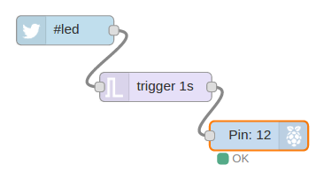
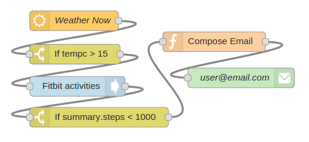
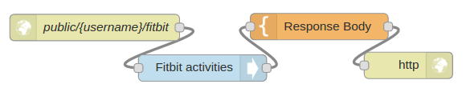
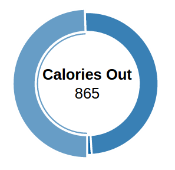

## Mục lục
- 1. [Lecture1](#1)

## Lecture1 

Nội dung:

- 1 số ví dụ về Node-RED

- Ý tưởng cơ bản của Node-RED

- Lịch sử và những ưu điểm

Node-RED là công cụ để xây dựng các ứng dụng IoT tập trung vào việc đơn giản hóa kết nối các thành phần lại với nhau để hoàn thành nhiệm vụ. Sử dụng huóng tiếp cận lập trình trực quan hóa, cho phép các lập trình viên kết nối các khối code- được gọi là các ```node```, lại với nhau để hoàn thành nhiệm vụ nào đó. Tập hợp các khối được kết nối, thường bao gồm 1 tập các input node, processing node và output node, được gọi là ```flows```.

### Ví dụ  1.1: Sử dụng Twitter để điều khiển Raspberry PI



Node-RED là công cụ lập trình trực quan giúp kết nối các ```node``` để tạo thành ```flows```. Trong ví dụ này, 3 node tạo thành 1 flow. Các sự kiện, ví dụ tweet #led, được chuyển thành thông điệp, ```flow``` giữa các "dây" kết nối các node.Mỗi node xử lí thông điệp đầu vào, gửi thông điệp được xử lí ở đầu ra cho node tiếp theo trong flow.

### Ví dụ 1.2. Sử dụng Node-RED để nhắc lịch thể dục



Ví dụ trên thu thập dữ liệu thời tiết và dữ liệu luyện tập trong ngày để đưa ra thông báo. Trên thực tế, có thể sử dụng flow trên vào nhiều bài toán khác như kiểm tra trạng thái các thiết bị trong nhà, của máy tính trong 1 server, thiết bị trong nhà máy... sử dụng output này để gửi mail, tweet, điều khiển các thiết bị điện tử...

Các nút được sử dụng trong ví dụ này đều có sẵn trong Node-RED, ta chỉ cần cấu hình phù hợp lại với yêu cầu của mình. Node-RED là công cụ mạnh mẽ để "đi dây" input và output lại với nhau, cung cấp rất nhiều node có sẵn hoặc do cộng đồng Node-RED phát triển, xử lí các nhiệm vụ ở phạm vi đáng ngạc nhiên.

### Ví dụ 1.3. Xây dựng dịch vụ web bằng nút HTTP có sẵn trong Node-RED



Ở ví dụ này, 2 nút đầu và cuối là 2 nút http input và ouput hoạt động cùng nhau 
lắng nghe và phản hồi lại thông điệp HTTP request. Nút ```fitbit``` lấy dữ liệu luyện tập thể dục cá nhân trên trang fitbit.com, nút ```Response``` sử dụng dữ liệu này để tạo trang html được hiển thị trên trình duyệt, nút ```http``` đóng gói trang html này vào trong thông điệp HTTP để gửi lại phía trình duyệt, kết quả:



### Node-RED và IoT

Khi IBM tạo ra Node-RED, họ chủ yếu tập trung vào IoT, đóng vai trò là 1 công cụ phát triển nhanh ứng dụng IoT mạnh mẽ và mềm dẻo. Sức mạnh của Node-RED đến từ 2 đặc điểm:

- Node-RED là 1 ví dụ của mô hình lập trình flow-based- sự kiện tạo thành thông điệp, thông điệp được xử lí tạo ra ouput. Mô hình ứng dụng rất tốt trong các ứng dụng IoT, nơi mỗi sự kiện được xử lí bằng các hành động tương ứng. Node-RED biểu diễn mỗi sự kiện là 1 thông điệp tạo ra sự đơn giản và thống nhất cho việc xử lí và truyền đi.

- Tập hợp các node có sẵn trong Node-RED chính là điểm mạnh thứ hai. Node-RED cung cấp cho các nhà phát triển các khối có sẵn, cho phép kết nối chúng lại để hoàn thành công việc mà không cần bận tâm đến vấn đề lập trình.

Tuy nhiên, Node-RED cũng có những điểm yếu:

- Với các ứng dụng phức tạp nhiều chức năng, việc trực quan hóa và quản lí trở nên phúc tạp, rối rắm hơn.

- Flow-based không phải lúc nào cũng phù hợp cho phát triển ứng dụng, như các ngôn ngữ lập trình khác có điểm yếu và điểm mạnh riêng, ví dụ điển hình là vòng lặp:
Node-RED xử lí rườm rà khi gặp vòng lặp.

- Đối với 1 vài use case cụ thể ví dụ Phân tích dữ liệu hoặc phát triển giao diện, Node-RED không hỗ trợ các trường hợp này và không dễ dàng hỗ trợ. Nếu muốn, ta cần triển khai ứng dụng 1 phần hay toàn bộ  ở ngôn ngữ khác và dùng Node-RED để điều khiển.

