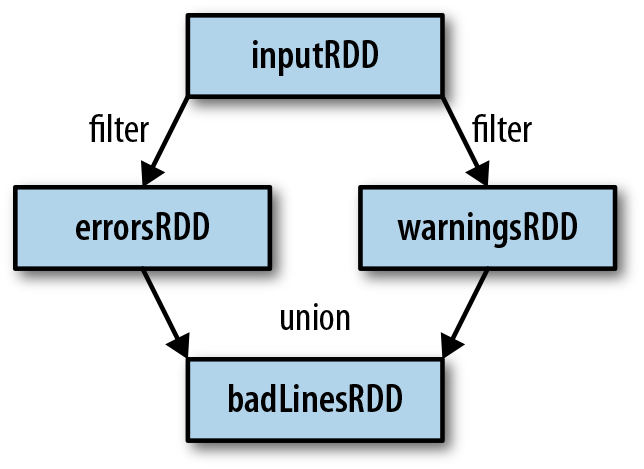

## RDD

RDD là đối tượng chứa dữ liệu trong spark. 

Trong spark mọi công việc đều thực hiện trên RDD: tạo mới RDD, thực hiện các hành động trên RDD để tính toán, biến đổi các RDD. Spark tự động phân tán dữ liệu trong RDD và song song hóa hành động thực hiện trên nó.

### Cơ bản về RDD

RDD là 1 tập các đối tượng được phân tán. Mỗi RDD được chia thành nhiều <i>partions</i> để tính toán trên nhiều node.

RDD phục vụ 2 loại hành động: <i>transformations</i> và <i>actions</i>:

- <i>Transformations</i> tạo dựng 1 RDD mới trên 1 RDD có sẵn. 

- <i>Actions</i> tính toán kết quả dựa trên 1 RDD hoặc lưu nó ra đĩa.

RDD có thể được khai báo nhưng chỉ được tính toán cho đến khi nó được sử dụng trong 1 action lần đầu tiên.

RDD mặc định được dựng lại mỗi khi thực hiện action trên nó. Có thể yêu cầu spark lưu lại RDD để sử dụng trong các lần tính toán tiếp theo bằng phương thức RDD.```persist```

### Tạo RDD

Có 2 cách tạo: nạp từ đĩa hoặc tạo từ các tập hợp(list,array...) trong chương trình.

### RDD Operations

Phân biệt transformation và action bằng kiểu trả về: transformation trả về RDD còn actions trả về 1 vài kiểu dữ liệu khác.

#### Transformation

Transform được thực hiện theo cách <i>lazily</i>, chỉ khi thực hiện action trên RDD nó trả về.

Transform không làm thay đổi RDD gốc, nó trả về con trỏ đến RDD hoàn toàn mới, RDD ban đầu vẫn có thể sử dụng để làm việc khác. VIệc này dẫn đến các RDD được phân cấp tổ tiên, Spark lưu lại thông tin này trong đồ thị họ hàng(lineage graph).



#### Actions

Mỗi lần thực hiện actions toàn bộ RDD mới bắt đầu được xây dựng, để tránh kém hiệu quả nên ghi kết quả trung gian ra đĩa.

#### Lazy Evaluation

Có thể coi mỗi RDD là các chỉ dẫn để có được dữ liệu, dữ liệu chỉ thực sự được nạp khi cần.

### Data Partioning 

Hữu ích khi dữ liệu được sử dụng lại nhiều lần trong các thao tác trên key ví dụ join(static dataset join dynamic dataset).

Số phần nên bằng số core trong cluster.

## Nạp và lưu dữ liệu

### File Formats

### Text

Khi load 1 file text thành 1 RDD, mỗi dòng là 1 thành phần trong RDD đó. Có thể load nhiều file text cùng lúc để tạo thành 1 pair RDD, với key là tên file và value là nội dung mỗi file.

- ```sc.textFile()```

- ```<RDD>.saveAsTextFile()```

### JSON

- Load: Đọc vào như file text và parse từng dòng thành định dạng json.

- Save: ```<RDD>.saveAsTextFile()```

### CSV

Mỗi dòng là 1 bản ghi, mỗi thuộc tính cách nhau 1 dấu phẩy.

- Load: đọc như file text và xử lí từng dòng. 

- Save: ```saveAsTextFile()```

### SequenceFile

Chứa các thành phần thực thi giao diện Writable của Hadoop.

- Load: ```sc.sequenceFile(path, keyClass, valueClass, minPartitions)```, keyClass và valueClass phải là Writable class.

- Save: ```<RDD>.saveAsSquenceFile()```

### File Object

Chủ yếu được sử dụng để truyền thông giữa các Spark jobs. Sử dụng Java Serialization để ghi và có thể hơi chậm

Có thể save bất kì thứ gì dưới dạng object dễ dàng.

- Load: ```sc.objectFile()```

- Save: ```<RDD>.saveAsObjectFile()```

### Định dạng Hadoop

Ngoài các định dạng dữ liệu mà Spark cung cấp, ta có thể làm việc với tất cả các định dạng của Hadoop.

## Filesystem 

- Cục bộ: <i>files://</i>path

- HDFS: ```hdfs://master:port/path```

## Advanced Spark Progamming

### Accumulator

Biến toàn cục giữa các worker node trong Spark.

Cách hoạt động:

- Driver program tạo accumulator bằng cách gọi phương thức ```SparkContext.accumulator(initialValue)```

- Worker có thể tăng giá trị của biến này bằng ```+=``` hoặc ```add```

- Driver program có thể truy cập giá trị biến này bằng phương thức ```value()``` hoặc ```setvalue```.

Các task trong worker không thể truy cập giá trị của accumulator, đây là biến chỉ ghi với chúng. 

Spark đảm bảo accumulator được tăng 1 lần duy nhất khi thực hiện action, task được chạy lại không tăng giá trị biến này. Tuy nhiên với transform biến này có thể cập nhật lại nhiều lần bởi cùng 1 task khi nó được thực hiện lại(do lỗi, chạy chậm...).

### Biến Broadcast

Biến global chỉ đọc giữa các worker.


