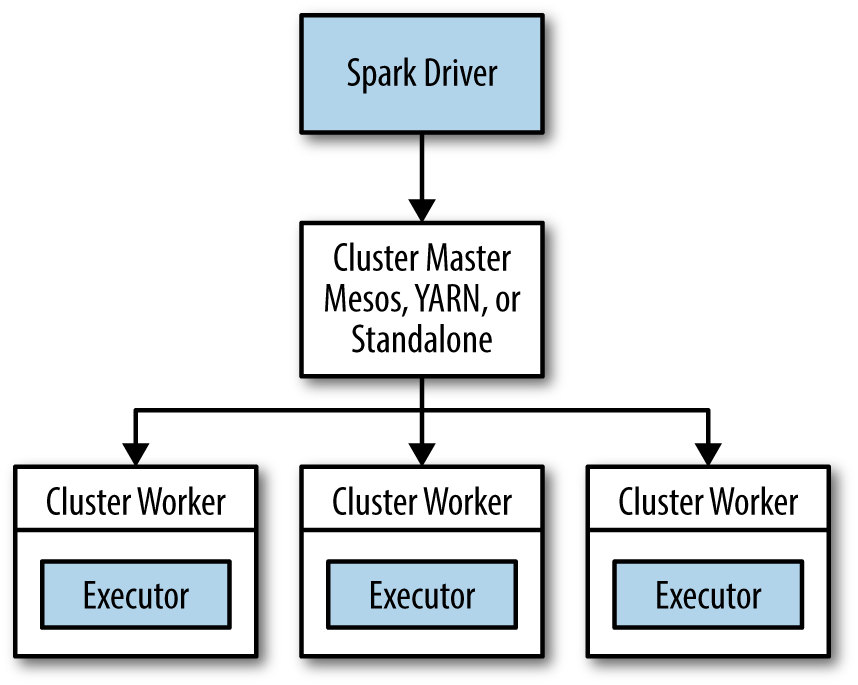

## RDD

RDD là đối tượng chứa dữ liệu trong spark. 

Trong spark mọi công việc đều thực hiện trên RDD: tạo mới RDD, thực hiện các hành động trên RDD để tính toán, biến đổi các RDD. Spark tự động phân tán dữ liệu trong RDD và song song hóa hành động thực hiện trên nó.

### Cơ bản về RDD

RDD là 1 tập các đối tượng được phân tán. Mỗi RDD được chia thành nhiều <i>partions</i> để tính toán trên nhiều node.

RDD phục vụ 2 loại hành động: <i>transformations</i> và <i>actions</i>:

- <i>Transformations</i> tạo dựng 1 RDD mới trên 1 RDD có sẵn. 

- <i>Actions</i> tính toán kết quả dựa trên 1 RDD hoặc lưu nó ra đĩa.

RDD có thể được khai báo nhưng chỉ được tính toán cho đến khi nó được sử dụng trong 1 action lần đầu tiên.

RDD mặc định được dựng lại mỗi khi thực hiện action trên nó. Có thể yêu cầu spark lưu lại RDD để sử dụng trong các lần tính toán tiếp theo bằng phương thức RDD.```persist```

### Tạo RDD

Có 2 cách tạo: nạp từ đĩa hoặc tạo từ các tập hợp(list,array...) trong chương trình.

### RDD Operations

Phân biệt transformation và action bằng kiểu trả về: transformation trả về RDD còn actions trả về 1 vài kiểu dữ liệu khác.

#### Transformation

Transform được thực hiện theo cách <i>lazily</i>, chỉ khi thực hiện action trên RDD nó trả về.

Transform không làm thay đổi RDD gốc, nó trả về con trỏ đến RDD hoàn toàn mới, RDD ban đầu vẫn có thể sử dụng để làm việc khác. VIệc này dẫn đến các RDD được phân cấp tổ tiên, Spark lưu lại thông tin này trong đồ thị họ hàng(lineage graph).


#### Actions

Mỗi lần thực hiện actions toàn bộ RDD mới bắt đầu được xây dựng, để tránh kém hiệu quả nên ghi kết quả trung gian ra đĩa.

#### Lazy Evaluation

Có thể coi mỗi RDD là các chỉ dẫn để có được dữ liệu, dữ liệu chỉ thực sự được nạp khi cần.

### Data Partioning 

Hữu ích khi dữ liệu được sử dụng lại nhiều lần trong các thao tác trên key ví dụ join(static dataset join dynamic dataset).

Số phần nên bằng số core trong cluster.

---
## Nạp và lưu dữ liệu

### File Formats

### Text

Khi load 1 file text thành 1 RDD, mỗi dòng là 1 thành phần trong RDD đó. Có thể load nhiều file text cùng lúc để tạo thành 1 pair RDD, với key là tên file và value là nội dung mỗi file.

- ```sc.textFile()```

- ```<RDD>.saveAsTextFile()```

### JSON

- Load: Đọc vào như file text và parse từng dòng thành định dạng json.

- Save: ```<RDD>.saveAsTextFile()```

### CSV

Mỗi dòng là 1 bản ghi, mỗi thuộc tính cách nhau 1 dấu phẩy.

- Load: đọc như file text và xử lí từng dòng. 

- Save: ```saveAsTextFile()```

### SequenceFile

Chứa các thành phần thực thi giao diện Writable của Hadoop.

- Load: ```sc.sequenceFile(path, keyClass, valueClass, minPartitions)```, keyClass và valueClass phải là Writable class.

- Save: ```<RDD>.saveAsSquenceFile()```

### File Object

Chủ yếu được sử dụng để truyền thông giữa các Spark jobs. Sử dụng Java Serialization để ghi và có thể hơi chậm

Có thể save bất kì thứ gì dưới dạng object dễ dàng.

- Load: ```sc.objectFile()```

- Save: ```<RDD>.saveAsObjectFile()```

### Định dạng Hadoop

Ngoài các định dạng dữ liệu mà Spark cung cấp, ta có thể làm việc với tất cả các định dạng của Hadoop.

---
## Filesystem 

- Cục bộ: <i>files://</i>path

- HDFS: ```hdfs://master:port/path```

---
## Advanced Spark Progamming

### Accumulator

Biến toàn cục giữa các worker node trong Spark.

Cách hoạt động:

- Driver program tạo accumulator bằng cách gọi phương thức ```SparkContext.accumulator(initialValue)```

- Worker có thể tăng giá trị của biến này bằng ```+=``` hoặc ```add```

- Driver program có thể truy cập giá trị biến này bằng phương thức ```value()``` hoặc ```setvalue```.

Các task trong worker không thể truy cập giá trị của accumulator, đây là biến chỉ ghi với chúng. 

Spark đảm bảo accumulator được tăng 1 lần duy nhất khi thực hiện action, task được chạy lại không tăng giá trị biến này. Tuy nhiên với transform biến này có thể cập nhật lại nhiều lần bởi cùng 1 task khi nó được thực hiện lại(do lỗi, chạy chậm...).

### Biến Broadcast

Biến toàn cục chỉ đọc giữa các worker, cho phép chương trình gửi tới tất cả các worker node để sử dụng trong 1 hay nhiều Spark operations.

---
## Phân tán

### Spark Runtime Architecture

Spark sử dụng chế độ master/slave với 1 node điều phối trung tâm gọi là <b>driver</b> và nhiều node worker gọi là <b>excutor</b>.



1 driver và nhiều excutor của nó tạo thành 1 ứng dụng spark. 1 ứng dụng spark được triển khai trên các máy bằng 1 dịch vụ ngoài gọi là <i>cluster manager</i>. Spark được đóng gói kèm với bộ quản lí cluster có sẵn là Standalone, hoặc có thể hoạt động cùng với Hadoop YARN và Apache Mesos.

#### Driver

Driver là tiến trình mà hàm ```main()``` của chương trình được chạy. Nó là tiến trình chạy code của lập trình viên, tạo SparkContext,tạo RDD, thực hiện transform và action.

Khi driver chạy, nó thực hiện 2 việc:

- <i>Chuyển chương trình của user thành các task</i>:

   Spark drive chịu trách nhiệm chuyển chương trình của người dùng thành các đơn vị thực thi vật lí gọi là các task. Ở mức cao, tất cả các ứng dụng Spark tuân theo 1 cấu trúc: tạo các RDD, thực hiện thao tác trên RDD để lấy và lưu trữ kết quả. Ở mức thấp, drive xác định các transformation và action cần thực hiện, mỗi hành động này là 1 task. Dựa trên luồng thực hiện của chương trình, các task này được sắp xếp thành 1 đồ thị có hướng không chứa chu trình(DAG) gọi là logical plan. Một số task liên tiếp nhau có thể gộp lại thành 1 <i>stage</i> tùy thuộc vào loại hành động. Các task cuối cùng được gói lại và chuẩn bị được gửi tới cluster. Task là đơn vị nhỏ nhất của công việc trong Spark, 1 chương trình có thể có hàng trăm tới hàng nghìn task.


- <i>Lập lịch thực các task trên executor</i>:

   Executor tự đăng kí với driver, tại mọi thời điểm đều có thông tin đầy đủ về tất cả các executor của ứng dụng. Mỗi executor biểu diễn 1 tiến trình có khả năng thực hiện task và lưu trữ dữ liệu từ RDD.

   Spark driver tìm trong tập các executor hiện có để lập lịch cho mỗi task vị trí phù hợp dựa trên vị trí của dữ liệu. Khi task được thực thi, có thể dữ liệu sẽ được cache lại, driver giữ thông tin về cache và sử dụng để lập lịch cho task sẽ truy cập dữ liệu cache này.

#### Executor 

là tiến trình chịu trách nhiệm thực hiện các task của 1 job Spark. Executor được khởi động khi bắt đầu chương trình và thường chạy cho đến khi chương trình kết thúc. 

Nó có 2 vai trò: thực thi task trả kết quả cho driver; lưu RDD trong bộ nhớ chính.

#### Cluster manager

Cả driver và executor có thể chạy trong worker node của YARN.

Các bước khi chạy ứng dụng Spark trong cluster:

1. Người dùng gọi ```spark-submit``` để chạy ứng dụng

2. ```spark-submit``` khởi động driver và gọi hàm ```main()```

3. Driver liên lạc và yêu cầu cluster manager tài nguyên để khởi động các executor.

4. Cluster manager khởi động executor 

5. Driver gửi công việc cần thực hiện cho executor.

6. Executor thực hiện các task và lưu kết quả.

7. Nếu hàm ```main()``` kết thúc hoặc gọi ```SparkContext.stop()```, nó sẽ kết thúc các executor và trả tài nguyên cho cluster manager.

---
## Spark Streaming

Nếu như spark được xây dụng dựa trên ý tưởng các RDD, Spark Streaming được xây dựng trên <i>DStream</i>. Một DStream là 1 chuỗi dữ liệu đến theo thời gian. Mỗi DStream là 1 chuỗi của các RDD đến tại 1 thời điểm. DStream có thể được tạo từ nhiều nguồn khác nhau, ví dụ như Flume, Kafka, HDFS. Có 2 loại hành động trên DStream: <i>transformations</i>, tạo mới 1 DStream và <i>output operations</i>, ghi dữ liệu ra hệ thống bên ngoài. DStream cung cấp rất nhiều hành động tương tự trên RDD cộng thêm các hành động liên quan đến thời gian ví dụ như sliding windows.

### Kiến trúc hệ thống

Spark Streaming sử dụng kiến trúc "micro-batch", dòng dữ liệu được coi là 1 chuỗi các tính toán trên các batch dữ liệu. Nó nhận dữ liệu từ nhiều nguồn và nhóm chúng lại thành các batch. Các batch mới được tạo theo từng khoảng thời gian nhất định <i>batch interval</i>.Mỗi batch tạo nên 1 RDD và được xử lí qua các Spark jobs. Kết quả được đẩy qua các hệ thống bên ngoài theo từng batch.


Ta có thể tạo DStream từ nguồn bên ngoài hoặc áp dụng <i>transformations</i> trên DStream khác. Ngoài các hành động như RDD, DStream còn có "stateful" transformation kết tập dữ liệu qua thời gian. 

Với mỗi nguồn dữ liệu đầu vào, Spark Streaming khởi tạo 1 <i>receivers</i>, là task chạy trên excutor thu thập dữ liệu và lưu lại thành RDD.


Dữ liệu được copy sang node thứ hai để tăng khả năng chịu lỗi. 

### Transformations

#### Stateless 

Mỗi batch được xử lí độc lập với batch trước nó, là các RDD transformation được áp dụng trên mỗi batch(hay mỗi RDD trong DStream). 

Có thể kết hợp dữ liệu từ nhiều DStream tại mỗi thời điểm, ví dụ ```join()```, ```union()```...

DStream còn cung cấp toán tử ```transform()``` cho phép thực hiện bất kì hàm RDD-to-RDD nào trên dòng dữ liệu. Hàm này được gọi trên mỗi batch dữ liệu của stream để tạo nên stream mới, ví dụ:

```scala 
val outlierDStream = accessLogsDStream.transform { rdd =>
extractOutliers(rdd)
}
```

#### Stateful

Dữ liệu từ quá khứ được sử dụng để tạo ra dữ liệu hiện tại. Có 2 loại chính: thao tác cửa sổ, thực hiện trên cửa sổ trượt theo thời gian và ```updateStateByKey()```. Stateful yêu cầu checkpoint để chịu lỗi, ví dụ: ```ssc.checkpoint("hdfs://...")```

- <b>Windowed transformations</b>:

Cần 2 tham số là kích cỡ cửa sổ và độ dài bước trượt, đều là bội số của 1 lần batch. Thao tác trên cửa sổ đơn giản nhất có thể thực hiện là ```window()``` trả về DStream mới với dữ liệu đến được gộp lại thành từng khối.

- <b>UpdateStateByKey</b>:
(key,event)->update (key,state).
ví dụ đếm số thông điệp HTTP có cùng mã trả về. key là mã thông điệp, sự kiện là có log HTTP mới, trạng thái là số lượng mỗi mã trả về.

### Output

Giống như RDD, nếu không có thao tác output nào được áp dụng trên stream sau khi transformation thì tính toán sẽ không được thực hiện. Nếu không có thao tác output nào được cài trên StreamingContext, context sẽ không khởi động.

```foreachRDD()``` là hàm output cho phép thực hiện thao tác trên từng RDD trong stream, tương tự như ```transform()``` cho phép truy cập từng RDD

## 24/7

Cài đặt để hệ thống hoạt động ổn định 24/7.

### Checkpoint

Cho phép Spark lưu dữ liệu của ứng dụng ra hệ thống lưu trữ tin cậy như HDFS để khôi phục khi có lỗi.

- Giới hạn số tính toán phải thực hiện lại khi có lỗi

- Chịu lỗi khi driver crash, khởi động lại driver.

### Chịu lỗi driver 

```getOrCreate()``` khởi đông lại sử dụng checkpoint để tiếp tục tính toán.

### Lỗi worker

Tất cả dữ liệu nhận được từ nguồn đều được sao lưu giữa các worker

### Lỗi receiver

Tùy thuộc vào nguồn cấp(có thể gửi lại dũ liệu không).

### Đảm bảo xử lí 1 lần 

Xử lí do lập trình viên.

