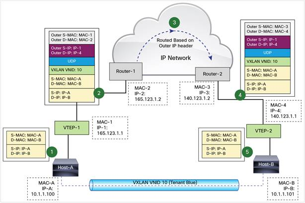

## Tổng quan

VXLAN cung cấp khả năng chia mạng con như VLAN với tính mở rộng và mềm dẻo hơn.

- VXLAN có thể cung cấp khả năng chia tới 16 triệu mạng con.
- VXLAN được xây dựng trên tầng giao vận(Tầng 3) nên kế thừa toàn bộ tiện ích định tuyến, truyền nhận gói tin của tầng 3.

VXLAN là 1 mạng overlay (Layer 2 over layer3), gói tin tầng 2 được lồng vào trong gói tin UDP để giao vận. Sử dụng phương thức đóng gói MAC-In-UDP để đưa frame tin ở tầng số 2 vào trong gói tin UDP-IP.

## Nguyên lí hoạt động

### Khuôn dạng gói tin

VXLAN header được gắn với L2 frame ban đầu và đóng gói vào trong payload của UDP.

Phần VXLAN header bao gồm 8 byte trong đó có 24 bit VNID đánh dấu tên mạng VXLAN. Với 24 bit này, có thể có tới 16 triệu mạng LAN trong 1 mạng VXLAN.

### VXLAN Tunnel Endpoint(VTEP)

VTEP là thiết bị quan trọng trong mạng VXLAN. Là cầu nối giữa các thiết bị trong mạng VXLAN với mạng IP bên ngoài. Có chức năng dóng gói - mở gói tin VXLAN và chuyển lại gói tin cho các thiết bị trong mạng. Cung cấp tính trong suốt cho mạng VXLAN.

VTEP có thể là thiết bị vật lí hoặc ảo hóa. Mỗi VTEP có 2 interface: 1 interface đóng vai trò là switch giữa các thiết bị đầu cuối trong mạng VXLAN, 1 IP interface kết nối với phần mạng IP giao vận.

Phần IP interface của VTEP có địa chỉ IP để định danh VTEP trên mạng IP(có thể là 1 mạng VLAN thông thường). VTEP sử dụng IP này để đóng gói frame Ethernet vào 
trong UDP và truyền gói tin này tới VTEP khác thông qua mạng IP. VTEP có cơ chế tự học ánh xạ MAC-to-VTEP thông qua IP interface.

### Giao tiếp Unicast trong VXLAN
 

Host-A và Host-B nằm chung 1 trong mạng VNID = 10 giao tiếp với nhau. Cho rằng việc học địa chỉ là đã được hoàn tất từ trước.

1. Khi A truyền tin cho B, nó vẫn tạo ra 1 frame Ethernet thông thường với địa chỉ MAC nguồn là của nó còn địa chỉ MAC đích là của B.

2. A gừi frame tin này tới VTEP-1. VTEP-1 biết rằng MAC-B nằm ở VTEP-2, nó thực hiện đóng gói frame tin này trong gói tin UDP, gói tin UDP lại được đóng gói vào trong gói tin IP với địa chỉ IP nguồn là VTEP-1, địa chỉ IP đích là VTEP-2. Gói tin IP này lại đuợc đóng gói vào trong frame Ethernet để chuyển tới Router-1 với MAC nguồn là VTEP-1, MAC đích là của Router-1.

3. Gói tin này sẽ được định tuyến trên trên tầng IP và đến VTEP-2.

4. VTEP-2 nhận được gói tin, nó bóc phần bên ngoài để lấy phần Ethernet bên trong, chuyển gói tin tới B dựa vào địa chỉ MAC của B.

A và B lúc này giao tiếp với nhau nhờ địa chỉ MAC như trong 1 mạng LAN thông thường mà không cần biết đến việc đóng gói và mở gói tin ở 2 VTEP.

A và B phải nằm trong cùng VXLAN mới giao tiếp được. Các VM nằm trên các VXLAN khác nhau không thể giao tiếp với nhau.
 
### Broadcast trong VXLAN

1. Ở đây, do A chỉ biết IP của B mà chưa biết MAC của B nên nó tạo ra 1 ARP request ra toàn mạng(như mạng LAN thông thường).

2. Gói tin được chuyển đến VTEP-1, VTEP-1 nhận thấy MAC đích là FF:FF:FF:FF:FF:FF nên đóng gói gói tin và chuyển multicast ra các VTEP trong cùng mạng VXLAN.

3. 2 VTEP này ghi nhận thông tin MAC-A nằm trong VTEP-1 có địa chỉ IP-1 vào trong bảng chuyển tiếp của mỗi VTEP. Sau đó bóc gói tin và chuyển cho toàn bộ các thiết bị trong mạng do nó quản lí.

4. Tại VTEP-2, B phản hồi lại ARP, do đã biết A nằm trên VTEP-1(tự học) nên VTEP-2 chuyển gói tin đến VTEP-1.

5. VTEP-1 nhận và bóc tin chuyển cho A, A biết MAC của B và bắt đầu truyền tin unicast

1 mạng LAN là 1 miền quảng bá (broadcast domain). Trong VXLAN việc xây dựng miền quảng bá dựa trên giao tiếp multicast của mạng IP, ở dây là mạng các các VTEP.
Các nhóm multicast được định địa chỉ từ 224.0.0.0 tới 239.255.255.255, trong khi đó có tới 16 triệu mạng VXLAN trong cùng 1 hệ mạng LAN nên có thể có nhiều VXLAN dùng chung 1 miền multicast.

Mỗi khi muốn gia nhập vào 1 mạng VXLAN, VTEP cần phải gửi gói tin IGMP tới các router để nhận được thông điệp multicast.

### Tài liệu tham khảo

- [1].[https://www.cisco.com/c/en/us/products/collateral/switches/nexus-9000-series-switches/white-paper-c11-729383.html](https://www.cisco.com/c/en/us/products/collateral/switches/nexus-9000-series-switches/white-paper-c11-729383.html) 
- [2].[https://tools.ietf.org/html/draft-mahalingam-dutt-dcops-vxlan-09#page-7](https://tools.ietf.org/html/draft-mahalingam-dutt-dcops-vxlan-09#page-7)
- [3].[https://sites.google.com/site/amitsciscozone/home/data-center/vxlan](https://sites.google.com/site/amitsciscozone/home/data-center/vxlan) 
